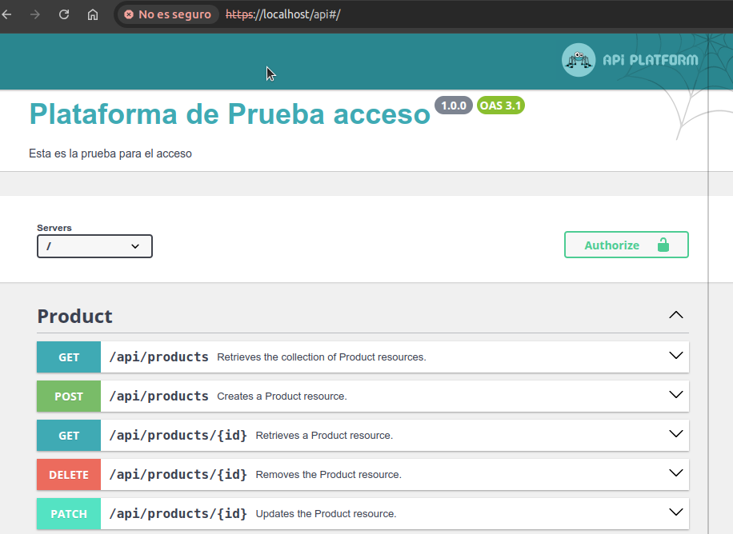
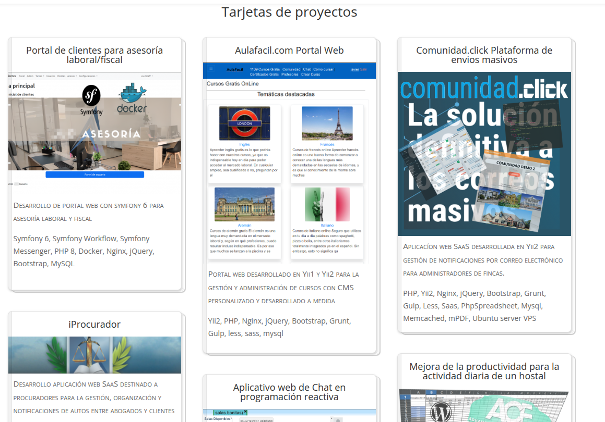

# Prueba
- Se ha utilizado symfony 6 headless, `platform api 3` y docker con sqlite para el desarrollo de la prueba.

## Pasos
- Descarga esta repo. *obvio, ¿no?* :-)
- Versión empleada de docker compose `Docker Compose version v2.35.1`
- Construir con `docker compose build --no-cache`.
- Asegurarse que no existe en local el puerto 80 abierto. Revisar que `sudo netstat -tulpn | grep :80` no arroje nada.
- Lanzar con `docker compose up -d`
- La primera vez lleva un rato de instalación inicial de paquetes de 10 minutos aprox, donde también se crea la base de datos y genera la estructura básica.
- Entrar en https://localhost/api y aceptar la excepción de SSL para poder entrar.
  
   
  
- Para lanzar tests unitarios, ejecutar `docker compose exec php ./bin/phpunit --testdox`

## Punto reconocido
- Reconozco que las excepciones (por ejemplo, al agregar dos veces el mismo producto) deben mostrarse en formato JSON y sin el stack-trace, es decir, retornar un header con código `4XX` en formato JSON normalizado como si de cualquier otra output se tratase, pero no he dado con la clave en esta ocasión :-(, ya que entorno `DEV` me generaba la excepción con las trazas típicas de un error, y en entorno `PROD` simplemente no me reportaba nada.
- He dejado el depurador activado en el contenedor.

## Notas del candidato
No quisiera que se redujera a solamente esta prueba la oportunidad de demostrar mis conocimientos en desarrollo web, ya que me gustaría que también pudieran considerar otros de mis varios trabajos relacionados con otras variadas tecnologías y cuyos conocimientos y experiencia he ido adquiriendo a lo largo de estos años, y me gustaría aportar a la compañía.

Mi portfolio:

