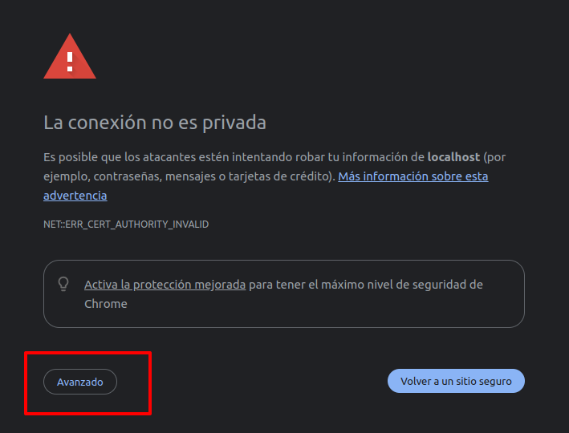

# Prueba
- Se ha utilizado symfony 6 headless, `platform api 3` y docker adaptado con sqlite para el desarrollo de la prueba.

## Pasos
- Descarga esta repo. *obvio, ¿no?* :-)
- Versión empleada de docker compose `Docker Compose version v2.35.1`
- Construir con `docker compose build --pull --no-cache`.
- Lanzar con `docker compose up -d`
- Entrar en <a href="https://localhost:4433/api" target="_blank">https://localhost:4433/api</a> y aceptar la excepción de SSL para poder entrar.

  
  
    

- Para lanzar tests unitarios, ejecutar `docker compose exec php ./bin/phpunit --testdox`

## Notas del candidato
- No quisiera que se redujera a solamente esta prueba la oportunidad de demostrar mis conocimientos en desarrollo web, ya que me gustaría que también pudieran considerar otros de mis varios trabajos relacionados con otras variadas tecnologías y cuyos conocimientos y experiencia he ido adquiriendo a lo largo de estos años, y me gustaría aportar a la compañía.

Mi portfolio:

